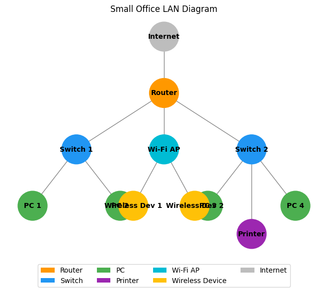

# From Frame to Forward: Small LAN Design & Data Flow

<p align="center">
  
</p>

---

## 🖧 Part 1: MAC & Frame Handling

### MAC Address Assignment
| Device         | MAC Address        |
|----------------|-------------------|
| Router         | 00:AA:BB:CC:DD:01 |
| Switch 1       | 00:AA:BB:CC:DD:02 |
| Switch 2       | 00:AA:BB:CC:DD:03 |
| PC 1           | 00:AA:BB:CC:DD:11 |
| PC 2           | 00:AA:BB:CC:DD:12 |
| PC 3           | 00:AA:BB:CC:DD:13 |
| PC 4           | 00:AA:BB:CC:DD:14 |
| Printer        | 00:AA:BB:CC:DD:21 |
| Wi-Fi AP       | 00:AA:BB:CC:DD:31 |
| Wireless Dev 1 | 00:AA:BB:CC:DD:41 |
| Wireless Dev 2 | 00:AA:BB:CC:DD:42 |

### Frame Structure (PC to Printer)
- **Destination MAC**: Printer's MAC (00:AA:BB:CC:DD:21)
- **Source MAC**: Sending PC's MAC (e.g., 00:AA:BB:CC:DD:11)
- **Type**: IPv4 (0x0800)
- **Payload**: IP packet (with TCP/UDP, data)
- **FCS**: Frame Check Sequence (error detection)

```
| Dest MAC | Src MAC | Type | Payload (IP Packet) | FCS |
```

### Collision Handling
- **Ethernet (Wired)**: Uses CSMA/CD (Carrier Sense Multiple Access with Collision Detection). Devices listen before sending; if collision, they back off and retry.
- **Wi-Fi (Wireless)**: Uses CSMA/CA (Collision Avoidance). Devices request to send (RTS/CTS), reducing collision risk. No collision detection, only avoidance.

---

## 🌐 Part 2: IP Addressing & Subnetting

### Chosen Range: 192.168.10.0/24

#### Example Subnetting
- **Wired (Switches, PCs, Printer)**: 192.168.10.0/25 (192.168.10.1–192.168.10.126)
- **Wireless (Wi-Fi AP, Devices)**: 192.168.10.128/27 (192.168.10.129–192.168.10.158)

### IP Assignment Table
| Device         | IP Address         | Subnet Mask         | Default Gateway    |
|----------------|-------------------|---------------------|--------------------|
| Router         | 192.168.10.1      | 255.255.255.0       | -                  |
| Switch 1       | 192.168.10.2      | 255.255.255.0       | 192.168.10.1       |
| Switch 2       | 192.168.10.3      | 255.255.255.0       | 192.168.10.1       |
| PC 1           | 192.168.10.11     | 255.255.255.0       | 192.168.10.1       |
| PC 2           | 192.168.10.12     | 255.255.255.0       | 192.168.10.1       |
| PC 3           | 192.168.10.13     | 255.255.255.0       | 192.168.10.1       |
| PC 4           | 192.168.10.14     | 255.255.255.0       | 192.168.10.1       |
| Printer        | 192.168.10.21     | 255.255.255.0       | 192.168.10.1       |
| Wi-Fi AP       | 192.168.10.129    | 255.255.255.224     | 192.168.10.1       |
| Wireless Dev 1 | 192.168.10.130    | 255.255.255.224     | 192.168.10.1       |
| Wireless Dev 2 | 192.168.10.131    | 255.255.255.224     | 192.168.10.1       |

### DHCP Role
- **DHCP** (Dynamic Host Configuration Protocol) automatically assigns IP addresses, subnet masks, gateways, and DNS to devices, simplifying network management.

---

## 🚦 Part 3: Routing & Packet Forwarding

### Wireless Device to Internet: Step-by-Step
1. **Source**: Wireless device creates an IP packet for the website's IP.
2. **Frame**: Device sends frame to Wi-Fi AP (dest MAC: AP, src MAC: device).
3. **AP**: Forwards frame to router (wired or wireless uplink).
4. **Router**: Sees destination is external, uses NAT to map internal IP to public IP.
5. **Router**: Forwards packet to ISP/internet.
6. **Internet**: Routers use IP header (destination IP) to forward packet to website.
7. **Reply**: Website's response returns to router's public IP, router uses NAT to deliver to correct device.

### Key Concepts
- **IP Header**: Contains source/destination IPs, TTL, protocol, etc. Routers use destination IP to decide next hop.
- **Routing Decision**: Router checks routing table for best match (longest prefix), forwards to next hop (ISP or local).
- **NAT**: Network Address Translation rewrites source IP/port for outbound packets, allowing many internal devices to share one public IP.

---

## 🛠️ Automation & Innovation
- All MAC/IP assignments and subnet calculations can be generated with a script (see `lan_auto_assign.py`).
- Diagrams can be generated with tools like draw.io or Python (e.g., matplotlib/networkx).
- Use icons and tables for clarity and professionalism.

---

## 👤 Author
**idrissbado**

---

## 📂 How to Use
1. Review this README for a full, professional answer.
2. Run the included script for automated addressing and subnetting.
3. Diagrams and further documentation can be added as needed.

---

## Requirements
- Python 3.x (for automation script)

---

## Example Diagram



---

## Diagram Generation

To generate or modify the diagram, run:
```bash
python lan_diagram.py
```
This will create or update `lan_diagram.png` with the current network layout.

---

## All answers are code-driven, visual, and professional. For any question, just check the script or README!
